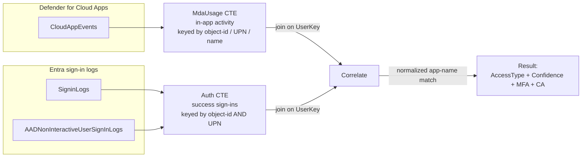

# Verified SaaS Usage – Identity Journey (Microsoft Sentinel Workbook)

An Azure Monitor / Microsoft Sentinel workbook that answers one IT Asset Management (ITAM) question:

> *For each SaaS application, which users are really using it — and is that usage backed by a verified corporate sign-in (MFA / Conditional Access) or not?*

It presents the same **App × User** question through **six complementary approaches** side by side, so you can compare what Entra sign-in logs say against what Defender for Cloud Apps (MDA) activity says, and reconcile the two.

## Files

| File | Purpose |
|------|---------|
| `Sentinel-Identity-Dashboard.workbook.json` | The workbook. Import via **Workbooks → New → Advanced Editor**. |

## The approaches

| # | Section | Source | Signal |
|---|---------|--------|--------|
| **A** | Union (Interactive + Non-interactive) · App × User Journey | `SigninLogs` ∪ `AADNonInteractiveUserSignInLogs` | Full journey: Sign-in → MFA → MFA Method → Conditional Access → Recency |
| **B** | Non-interactive sign-ins (direct) | `AADNonInteractiveUserSignInLogs` | Leanest path (no `union`/`mv-expand`); a fallback to confirm data flows |
| **C** | MDA activity (direct) | `CloudAppEvents` | `MDCAActivity` = user performed an in-app action captured by MDCA in range. Covers non-Entra apps |
| **D** | MDA × Entra cross-reference | `CloudAppEvents` ⨝ Entra sign-ins | `AccessType` = **Authenticated** (matching corporate sign-in) vs **Unauthenticated** |
| **E** | Entra × MDCA (Sentinel table) | `CloudAppEvents` (from `{Workspace}`) ⨝ Entra sign-ins | Same cross-reference as D, scoped to the **Sentinel** workspace |
| **F** | Entra × MDCA (Default workspace) | `workspace('{MDCAWorkspace}').CloudAppEvents` ⨝ Entra sign-ins | Reads MDCA from a **separate Default workspace** and joins it to Entra sign-ins from the Sentinel workspace via the KQL `workspace()` function |

Approaches **E/F** target the common case where MDCA / Defender for Cloud Apps data lands in a *different* Log Analytics workspace (often a `DefaultWorkspace-…`) than the Sentinel workspace holding Entra sign-in logs. A **data-location tile** shows `CloudAppEvents` counts in both workspaces side by side so you can see where the MDCA data actually exists.

Two **data-availability** tiles (Entra and MDA) show row/user/app counts per source so you can see at a glance which tables are actually ingesting data in the selected workspace.

## Filters

Filters are pills at the top and cascade top-to-bottom. **Select Workspace and Time Range first**; the query-backed pills then populate.

| Filter | Type | Notes |
|--------|------|-------|
| **Workspace** | Azure Resource Graph | Pick the Log Analytics / Sentinel workspace. |
| **MDCA Default Workspace** | Azure Resource Graph | Second workspace where MDCA / Defender (`CloudAppEvents`) lands — used only by the **Entra × MDCA (Default workspace)** section. Pick the `DefaultWorkspace-…` that ingests Defender data. |
| **Time Range** | Duration | 24h / 7d / 30d / 90d / custom. Scopes every table and the recency logic. |
| **User (type UPN or name)** | Free text | Partial, case-insensitive `contains` match. Free text (not a dropdown) because there are thousands of users. Leave blank for all. |
| **Application** | Multi-select | Populated from Entra `AppDisplayName`. Tick the 5–10 apps of interest, or leave **All**. |
| **Sign-in Status** | All / Success / Failure | Applies to Approaches A/B. |
| **Access Type** | All / Authenticated / Unauthenticated | Applies to Approach D. |

### Cross-taxonomy app matching (A/B vs C/D)

The **Application** list comes from **Entra** sign-in names (e.g. *Microsoft 365 Admin portal*), but MDA (`CloudAppEvents.Application`) often uses different names (e.g. *Microsoft 365*). Approaches **C/D** therefore **fuzzy-match** your selection to MDA app names (case-insensitive substring, either direction) so a specific-app pick still scopes them. Very broad names (e.g. *Office*) may pull in several MDA apps — leave **All** for the full MDA picture.

## How it works — end to end

The workbook turns raw identity + Defender telemetry into a single **“who really used this SaaS app, and was it authenticated?”** view. The pipeline is the same for every cross-reference table (Approaches **D / E / F**):



**Step by step:**

1. **Pick the app set** (`SelApps`) — the Entra-sourced **Application** filter is fuzzy-bridged to MDCA app names so a selection scopes the MDCA table despite the naming taxonomy mismatch.
2. **Build MDCA usage** (`MdaUsage`) — aggregate `CloudAppEvents` per app × user. The **user key** is the Entra object-id (`AccountObjectId`) when present, else the UPN (`AccountId` if it looks like an email), else the display name. Captures `MdaActivities`, `TotalDaysUsed`, `LastActive`.
3. **Build authenticated usage** (`Auth`) — aggregate successful Entra sign-ins (`ResultType == '0'`) from both sign-in tables. Crucially it emits **both** the object-id and the UPN as match keys (`mv-expand pack_array(Oid, Upn)`), so a match succeeds even when MDCA and Entra recorded the user under different identifiers. Captures MFA / Conditional Access hits and `LastSignIn`.
4. **Join on the user key**, then decide the **app match** with a normalized name comparison (`nrm()` strips spaces / `-` / `_` / `.` and lower-cases; exact match, or a length-guarded either-direction `contains`).
5. **Classify each row:**
   - `AccessType` = **Authenticated** if a matching corporate sign-in exists, else **Unauthenticated**.
   - `Confidence` = **High** (exact normalized app-name hit), **Medium** (some correlated sign-in), or **-** (none).
   - `MFA` / `CAVerified` = whether the correlated sign-ins used MFA / satisfied Conditional Access.
   - `LastSignIn` = most recent correlated Entra sign-in (compare against MDCA `LastActive`).

**Why the accuracy upgrade matters:** the original join matched on a single user key and a raw app-name `contains`, which missed users when the two systems stored different identifiers and produced false positives on short tokens. The dual-key (object-id **and** UPN) match plus normalized, length-guarded app matching sharply reduces both misses and false positives, and the new `Confidence` column tells you how much to trust each row.

**Where the data lives (E vs F):** MDCA data frequently lands in a *different* workspace than Entra sign-ins. Approach **E** reads `CloudAppEvents` from the primary Sentinel `{Workspace}`; Approach **F** reads it from the separate **MDCA Default Workspace** via the KQL `workspace('{MDCAWorkspace}')` function and joins it to Entra sign-ins from `{Workspace}`. The **data-location tile** shows `CloudAppEvents` counts in both workspaces so you know which table will actually return rows.

## Prerequisites

- **Microsoft Entra ID P1/P2** with the **Entra ID** data connector enabled — provides `SigninLogs` and/or `AADNonInteractiveUserSignInLogs` (Approaches A/B).
- **Microsoft Defender for Cloud Apps** connected to Sentinel — provides `CloudAppEvents` (Approaches C/D).
- **Reader** on the target Log Analytics / Sentinel workspace.

If a table shows *no data*, check the matching data-availability tile, widen the **Time Range**, or pick a different **Workspace**.

## How to add this workbook

You import the workbook JSON through the **Advanced Editor**. Pick the portal you use:

### Option A — Azure portal (Microsoft Sentinel / Log Analytics)

1. Get the file: download or copy `Sentinel-Identity-Dashboard.workbook.json` from this repo (open the file and use **Raw → Save As**, or `git clone` the repo).
2. In the [Azure portal](https://portal.azure.com), open **Microsoft Sentinel** and select your workspace (or open the **Log Analytics workspace** directly).
3. In the left menu under **Threat management** (Sentinel) — or **Monitoring** (Log Analytics) — click **Workbooks**.
4. Click **+ New** to create a blank workbook.
5. Click **Edit** (top toolbar), then open the **Advanced Editor** — the **`</>`** icon.
6. In the editor, make sure the **Gallery Template** tab is selected, **select all** existing JSON and **delete** it, then **paste** the full contents of `Sentinel-Identity-Dashboard.workbook.json`.
7. Click **Apply**. The workbook renders.
8. Click **💾 Save**, give it a name (e.g. *Verified SaaS Usage – Identity Journey*), choose the **Subscription**, **Resource group**, and **Location**, then **Save**.

### Option B — Microsoft Defender portal (unified SOC)

1. Go to the [Defender portal](https://security.microsoft.com) → **Microsoft Sentinel** → **Threat management** → **Workbooks**.
2. Follow the same **+ New → Edit → Advanced Editor (`</>`) → paste → Apply → Save** steps as Option A.

### First run

1. Select the **Workspace** and **Time Range** pills — these are required; most tiles stay empty until both are set.
2. (Optional) Pick the **MDCA Default Workspace** pill if your Defender / `CloudAppEvents` data lands in a separate workspace (powers the **Entra × MDCA (Default workspace)** section).
3. Use the **User** and **Application** filters to focus, and check the **data-availability** tiles first if a table is blank.

### Updating an existing copy

To apply a newer version: open the saved workbook → **Edit** → **Advanced Editor (`</>`)** → replace all JSON with the new file → **Apply** → **Save**. (Alternatively **Save As** a new copy to keep the old one.)

## Troubleshooting with KQL

When a table is empty or a row looks wrong, run these queries directly in **Logs** against the relevant workspace to isolate the cause. Replace `<mdca-workspace-id>` with the MDCA Default Workspace resource ID where noted. (In the workbook the workspace, time range, and filters are injected by the pills; here they are literal so you can run them standalone.)

### 1. Is Entra sign-in data flowing? (Approaches A/B source)

```kql
union isfuzzy=true
(SigninLogs | summarize Rows = count(), Users = dcount(UserPrincipalName), Apps = dcount(AppDisplayName) | extend Source = "SigninLogs (interactive)"),
(AADNonInteractiveUserSignInLogs | summarize Rows = count(), Users = dcount(UserPrincipalName), Apps = dcount(AppDisplayName) | extend Source = "AADNonInteractiveUserSignInLogs")
| project Source, Rows, Users, Apps
```

If both rows are 0, the Entra ID data connector is not ingesting into this workspace (or widen the time range). Interactive `SigninLogs` is often 0 while non-interactive has millions of rows — that is normal; the workbook unions both.

### 2. Is MDCA data flowing, and in which workspace? (Approaches C/D/E/F source)

Run in the **Sentinel** workspace:

```kql
CloudAppEvents | summarize Rows = count(), Users = dcount(AccountObjectId), Apps = dcount(Application)
```

Compare both workspaces in one query (the data-location tile logic — needs both workspaces in scope):

```kql
union isfuzzy=true
(CloudAppEvents | summarize Rows = count(), Users = dcount(AccountObjectId), Apps = dcount(Application) | extend Location = "Sentinel (primary workspace)"),
(workspace("<mdca-workspace-id>").CloudAppEvents | summarize Rows = count(), Users = dcount(AccountObjectId), Apps = dcount(Application) | extend Location = "MDCA Default workspace")
| project Location, Rows, Users, Apps
```

An empty side tells you MDCA is not ingesting there, so the matching cross-reference table (E for Sentinel, F for Default) will be blank. If the `workspace(...)` branch errors with *Failed to resolve entity 'CloudAppEvents'*, the MDCA workspace is not in the query's `crossComponentResources` (workbook) or you lack Reader on it (Logs).

### 3. Inspect the raw MDCA user keys (why a user did/didn't match)

```kql
CloudAppEvents
| extend AccOid = tolower(tostring(column_ifexists('AccountObjectId', '')))
| extend AccId  = tostring(column_ifexists('AccountId', ''))
| extend AccName = tostring(column_ifexists('AccountDisplayName', ''))
| extend AccUpn = tolower(iff(AccId has '@', AccId, ''))
| extend UserKey = iff(isnotempty(AccOid), AccOid, iff(isnotempty(AccUpn), AccUpn, tolower(AccName)))
| project TimeGenerated, Application, AccOid, AccId, AccName, AccUpn, UserKey
| take 50
```

Use this to confirm MDCA is populating `AccountObjectId` (the strongest key). If it is empty, matching falls back to UPN then display name.

### 4. Inspect the Entra dual-key side

```kql
union isfuzzy=true (SigninLogs), (AADNonInteractiveUserSignInLogs)
| where ResultType == '0'
| extend Oid = tolower(tostring(column_ifexists('UserId', ''))), Upn = tolower(tostring(column_ifexists('UserPrincipalName', '')))
| project TimeGenerated, AppDisplayName, Oid, Upn, AuthenticationRequirement, ConditionalAccessStatus
| take 50
```

Confirms `UserId` (Entra object-id) and `UserPrincipalName` are both present — the correlation emits both as match keys, so a match works if *either* aligns with the MDCA key.

### 5. The full correlation query (Approach D / E — copy-paste with literals)

This is the exact logic behind the cross-reference tables. Substitute a real UPN/name for `<user>` (or `''` for all), and use `'All'`, `'Authenticated'`, or `'Unauthenticated'` for `<accesstype>`.

```kql
let nrm = (s:string) { tolower(replace_string(replace_string(replace_string(replace_string(s, ' ', ''), '-', ''), '_', ''), '.', '')) };
let MdaUsage = CloudAppEvents
    | extend AccOid = tolower(tostring(column_ifexists('AccountObjectId', '')))
    | extend AccId = tostring(column_ifexists('AccountId', ''))
    | extend AccName = tostring(column_ifexists('AccountDisplayName', ''))
    | extend AccUpn = tolower(iff(AccId has '@', AccId, ''))
    | extend UserKey = iff(isnotempty(AccOid), AccOid, iff(isnotempty(AccUpn), AccUpn, tolower(AccName)))
    | extend DispUser = iff(isnotempty(AccUpn), AccUpn, AccName)
    | summarize MdaActivities = count(), LastActive = max(TimeGenerated), TotalDaysUsed = dcount(bin(TimeGenerated, 1d)), User = take_any(DispUser)
        by MdaApp = tolower(Application), NmMda = nrm(Application), UserKey;
let Auth = union isfuzzy=true (SigninLogs), (AADNonInteractiveUserSignInLogs)
    | where ResultType == '0'
    | extend Oid = tolower(tostring(column_ifexists('UserId', ''))), Upn = tolower(tostring(column_ifexists('UserPrincipalName', '')))
    | summarize SignIns = count(), MFAHits = countif(AuthenticationRequirement == 'multiFactorAuthentication'), CAHits = countif(ConditionalAccessStatus == 'success'), LastSignIn = max(TimeGenerated)
        by EntraApp = tolower(AppDisplayName), NmEntra = nrm(AppDisplayName), Oid, Upn
    | mv-expand UserKey = pack_array(Oid, Upn) to typeof(string)
    | where isnotempty(UserKey)
    | summarize SignIns = sum(SignIns), MFAHits = sum(MFAHits), CAHits = sum(CAHits), LastSignIn = max(LastSignIn) by EntraApp, NmEntra, UserKey;
MdaUsage
| join kind=leftouter (Auth) on UserKey
| extend AppMatch = isnotempty(NmEntra) and (NmMda == NmEntra or (strlen(NmMda) >= 4 and NmEntra contains NmMda) or (strlen(NmEntra) >= 4 and NmMda contains NmEntra))
| summarize SignIns = sum(iff(AppMatch, SignIns, 0)), ExactHits = sum(iff(AppMatch and NmMda == NmEntra, SignIns, 0)), MFAHits = sum(iff(AppMatch, MFAHits, 0)), CAHits = sum(iff(AppMatch, CAHits, 0)), LastSignIn = max(iff(AppMatch, LastSignIn, datetime(null))) by Application = MdaApp, User, MdaActivities, TotalDaysUsed, LastActive
| extend AccessType = iff(SignIns > 0, 'Authenticated', 'Unauthenticated')
| extend Confidence = iff(ExactHits > 0, 'High', iff(SignIns > 0, 'Medium', '-'))
| extend MFA = iff(MFAHits > 0, 'Yes', 'No'), CAVerified = iff(CAHits > 0, 'Verified', 'Not Applied')
| project Application, User, AccessType, Confidence, MFA, CAVerified, MdaActivities, TotalDaysUsed, LastActive, LastSignIn
| order by AccessType asc, MdaActivities desc
```

For **Approach F** (MDCA in a separate workspace), replace `CloudAppEvents` in the `MdaUsage` CTE with `workspace("<mdca-workspace-id>").CloudAppEvents` — the Entra tables stay bare because sign-ins live in the primary workspace.

### 6. Populate the Application filter (parameter dropdown)

```kql
union isfuzzy=true (SigninLogs), (AADNonInteractiveUserSignInLogs)
| where isnotempty(AppDisplayName)
| distinct AppDisplayName
| order by AppDisplayName asc
| take 1000
```

If this returns nothing, the **Application** pill will be empty — confirm sign-in data exists (query 1) before assuming a workbook bug.

### Common symptoms → likely cause

| Symptom | Likely cause / fix |
|---------|--------------------|
| Everything shows **Unauthenticated** | User keys don't align — check queries 3 & 4; MDCA may not populate `AccountObjectId`, or the app is authenticated by a **non-Entra IdP** (see PingID note below). |
| Cross-reference table **empty**, availability tile shows MDCA rows in the *other* workspace | You're looking at the wrong approach — use **E** for Sentinel-workspace MDCA, **F** for Default-workspace MDCA. |
| `Failed to resolve entity 'CloudAppEvents'` on E/F | MDCA workspace missing from the tile's `crossComponentResources`, or no Reader on it. |
| **Application** / **User** pill empty | Source table has 0 rows in the selected workspace/range (query 1/6). Widen Time Range or change Workspace. |
| A known app shows low **Confidence** | Names differ beyond the normalized/`contains` bridge — acceptable, or add a curated alias map. |

## Known limitations

- **Naming taxonomies differ** between Entra and MDA. The fuzzy bridge (above) reconciles most cases; a curated alias map is the follow-up if exact per-app parity is required.
- **Non-Entra IdPs (e.g. PingID)** produce no Entra sign-in, so those apps appear **Unauthenticated** in Approach D even when the user really did authenticate. The workbook's *How the correlation works* section documents how to ingest PingID/other IdP logs and `union` them into the authentication set to correct this.
- **Blank / GUID app names** on non-interactive sign-ins are backfilled from `ResourceDisplayName` then `AppId`, so you get a value instead of a blank.
- Query-backed **parameter dropdowns** require the Log Analytics `queryType`/`resourceType` and bind to the selected **Workspace** — they populate only after Workspace + Time Range are set.

## Disclaimer & support

This workbook is provided **as-is, without any warranty**, and is **not an official Microsoft product**. It is **not supported by Microsoft** — no Microsoft support channel, SLA, or hotfix commitment applies. Do **not** deploy it directly into a production environment without first **validating it in a test / non-production workspace** and reviewing every KQL query against your own data, schema, and RBAC.

You are responsible for testing, adapting, and maintaining it for your environment. Use at your own risk.

## License

Released under the **MIT License**.

```text
MIT License

Copyright (c) 2026

Permission is hereby granted, free of charge, to any person obtaining a copy
of this software and associated documentation files (the "Software"), to deal
in the Software without restriction, including without limitation the rights
to use, copy, modify, merge, publish, distribute, sublicense, and/or sell
copies of the Software, and to permit persons to whom the Software is
furnished to do so, subject to the following conditions:

The above copyright notice and this permission notice shall be included in all
copies or substantial portions of the Software.

THE SOFTWARE IS PROVIDED "AS IS", WITHOUT WARRANTY OF ANY KIND, EXPRESS OR
IMPLIED, INCLUDING BUT NOT LIMITED TO THE WARRANTIES OF MERCHANTABILITY,
FITNESS FOR A PARTICULAR PURPOSE AND NONINFRINGEMENT. IN NO EVENT SHALL THE
AUTHORS OR COPYRIGHT HOLDERS BE LIABLE FOR ANY CLAIM, DAMAGES OR OTHER
LIABILITY, WHETHER IN AN ACTION OF CONTRACT, TORT OR OTHERWISE, ARISING FROM,
OUT OF OR IN CONNECTION WITH THE SOFTWARE OR THE USE OR OTHER DEALINGS IN THE
SOFTWARE.
```
